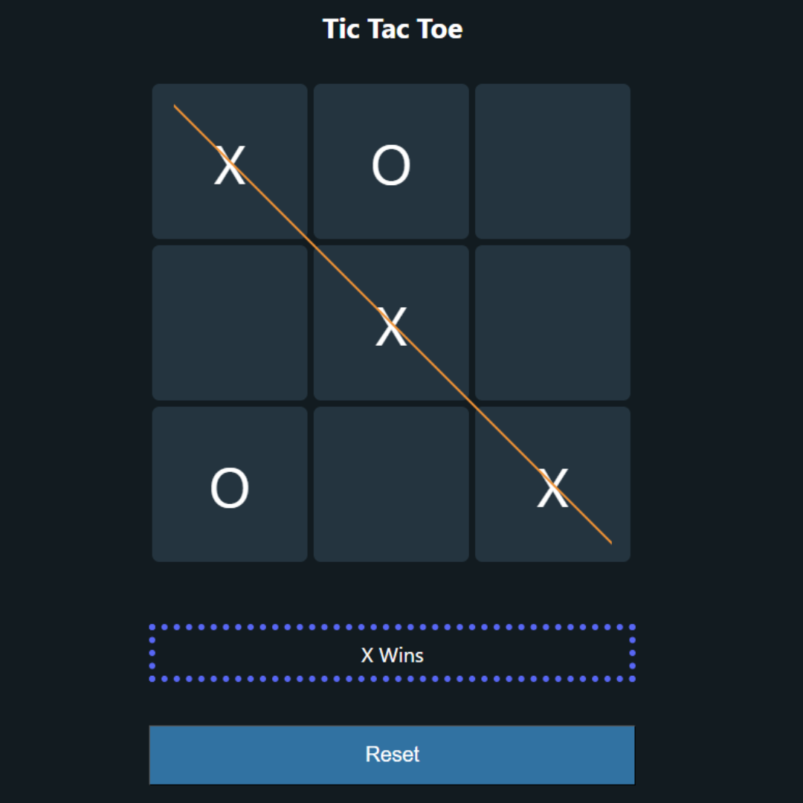

# Tic Tac Toe Game in React

<p align="center">
  
</p>

This project is a simple implementation of the classic Tic Tac Toe game using React. It follows the tutorial by [Coding With Adam](https://www.youtube.com/watch?v=4Gt_YyGf6B0).
However I did customize the board to my own liking.

## Table of Contents

- [Demo](#demo)
- [Features](#features)
- [Installation](#installation)
- [Usage](#usage)
- [Contributing](#contributing)
- [License](#license)
- [Tutorial](#tutorial)

## Demo

Include a link to a live demo of the Tic Tac Toe game or a screenshot.

## Features

Mention the key features of your Tic Tac Toe game:

- Interactive game board
- Two-player functionality
- Winner determination
- Reset option

# Installation

1. **Clone the repository:**

   ```bash
   git clone https://github.com/your-username/tic-tac-toe-react.git
   ```

2. **Navigate to the project directory:**

   ```bash
   cd tic-tac-toe-react
   ```

3. **Install dependencies:**

   ```bash
   npm install
   ```

## Usage

**Run the development server:**

```bash
npm start
```

Open your browser and visit http://localhost:3000 to play the game.

## Contributing

If you'd like to contribute to this project, please follow these guidelines:

1. Fork the project
2. Create your feature branch (`git checkout -b feature/YourFeature`)
3. Commit your changes (`git commit -m 'Add YourFeature'`)
4. Push to the branch (`git push origin feature/YourFeature`)
5. Open a pull request

## License

This project is licensed under the MIT License - see the [LICENSE.md](LICENSE.md) file for details.

## Tutorial

This project was built following the tutorial by [Coding With Adam](https://www.youtube.com/@CodingWithAdam). I did Check out the tutorial for a step-by-step guide.
